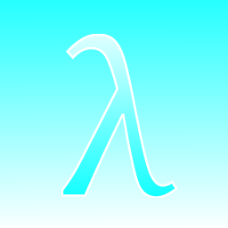
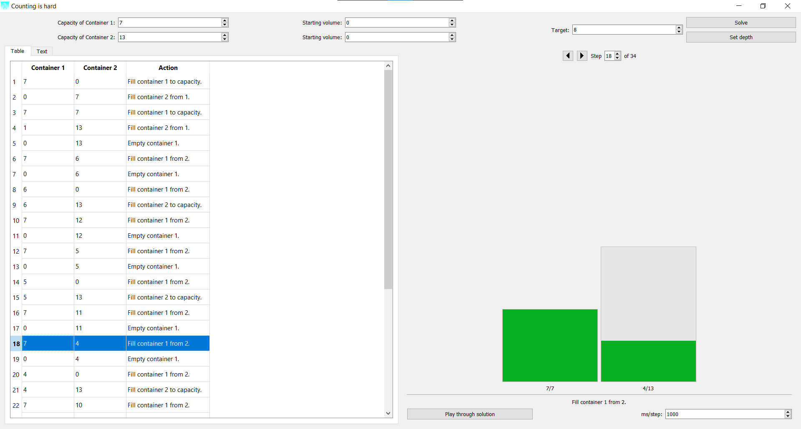
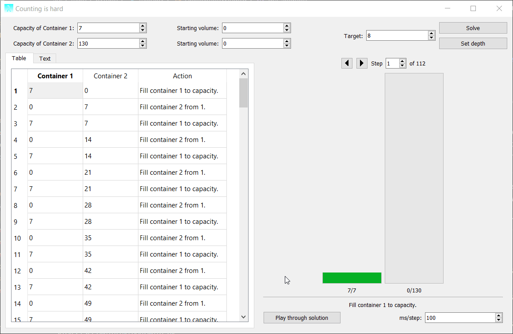

# water-pouring-puzzle-solver

  

A program built in PyQt5 and packaged with fbs for solving two-container water pouring puzzles.

I got angry enough at one of these that this one-day project was the result.

This solver uses exhaustive search (with partial memoization) - it's inefficient but it works. 

## Usage

See [solver_standalone.py](src/main/python/solver_standalone.py) for the base, non-ui version of the solver.

1. Enter container capacities
2. Enter a starting volume for the containers if desired
3. Enter a target volume
4. Click solve

 

You can click on a row in the table to jump to that step. Alternatively, you can navigate through steps by clicking on the back/forward buttons or using the spinbox. Click on "play through solution" to gradually step through the solution.

*Note: the progress bar resize function is somewhat flaky. They are resized when "solve" is clicked (after which the window cannot be resized to be smaller). Close the program or pick some small container sizes to fix.*

An interesting workaround to the recursion depth limit (which was not implemented into this program) is to get the last state of the containers before the recursion error, then restart with the same parameters + the starting volumes.

## Question/Definition of problem
*If container A has capacity x and container B has capacity y, then what steps must be taken such that either container A or container B hold the target volume z?*

(*x*, *y*, and *z* are normally integers. Expansion to all rational numbers is equivalent to dividing *x*, *y*, and *z* by some number.)

You lack the precision or accuracy required to fill the buckets to an arbitrary intermediate position (that is, you cannot just fill a bucket to the target volume). You do, however, have the ability to determine when a bucket is empty or full, as well as knowledge of the capacity of the two containers. You also have infinite water and can always empty a bucket.

The only available actions are:
- Completely empty container 1.
- Completely empty container 2
- Fill container 1 to capacity.
- Fill container 2 to capacity.
- Fill container 1 with the contents of container 2. Stop when either container 1 is full or container 2 is empty.
- Fill container 2 with the contents of container 1. Stop when either container 2 is full or container 1 is empty.

## Approach
To solve this problem:

- Perform all possible actions on the containers based on their current state.
- Determine if the target capacity has been reached.
  - If so, return a full list of the actions and steps up to this point.
  - If not, check if a permutation of the current capacities of the two containers has already been tested at some earlier point in time.
    - If so, kill this branch (perform no addition actions with these container states).
    - If not, go back to the first step with the new states of the containers. Add this action and step to an ongoing list. 

An interesting observation is that many solutions involve a pattern to gradually get to a certain value, often using multiples of some number to loop back around to the target volume.

